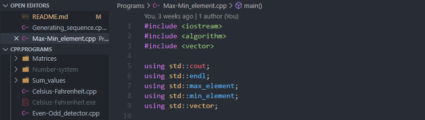

# C++ Practice Programs

Here almost every `C++` 🐱‍🏍 files are my Practice files. I learn all these from different Website, Apps, Online Courses and from my Teacher.

I'm 🎃 Working on `C++20` version and less than that.



&emsp;[](https://github.com/Koushikon/CPP.Programs)

✔ C++ Docs :  🐱‍👓 [CPP Reference][lnk0001] , [ISO CPP][lnk0002]

✔ C++ Notebook Online :  🐱‍🐉 [Project Jupyter][lnk0003]

✔ C++ Compilers Online :  🚴‍♀️ [Replit][lnk0004] , [Programiz][lnk0005] , [Compiler Explorer][lnk0006] , [Wandbox][lnk0007]

✔ Full forms :

```Plain
    HR -> HackerRank
    HE -> HackerEarth
    CF -> CodeForce
```

---

## Study :

- `Swapping` Entire folder
- `Matrix_chain_mul` Entire folder

---

<!-- External links  -->
[lnk0001]: https://en.cppreference.com/w/
[lnk0002]: https://isocpp.org/
[lnk0003]: https://jupyter.org/try
[lnk0004]: https://replit.com/languages/cpp
[lnk0005]: https://www.programiz.com/cpp-programming/online-compiler/
[lnk0006]: https://godbolt.org/
[lnk0007]: https://wandbox.org/

[lnk0008]: #
[lnk0009]: #
[lnk0010]: #
[lnk0011]: #
[lnk0012]: #
